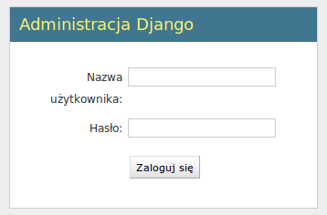
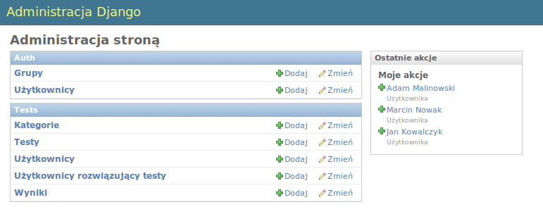
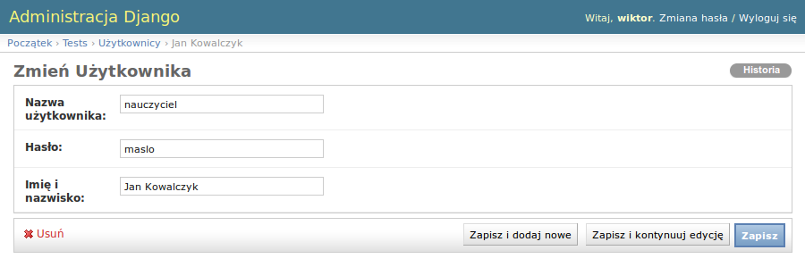

.. Podręcznik użytkownika - serwer knut - dokumentacja

Witamy w Podręczniku użytkownika serwera knut
=============================================

.. toctree::
   :maxdepth: 2

.. _wprowadzenie:

Wprowadzenie
============ 

Podręcznik ten jest przygotowany dla użytkownika i administratora serwera testów knut. Opisuje on zagadnienia związane z zarządzaniem informacjami  użytkowników edytora i programu do rozwiązywania testów.

Serwer knut to darmowe oprogramowanie służące do współdzielenia testów i wyników.
Umożliwia on zarządzanie testami, wynikami i kontami użytkowników.

Manipulacja testami powinna być prowadzona za pośrednictwem edytora testów. Panel administracyjny serwera testów pozwala na edycje informacji o testach i wyników testów, ale w normalnym użytkowaniu nie powinien być wykorzystywany. Jedyna funkcją, którą administrator powinien się zajmować w normalnym trybie pracy jest zarządzanie kontami użytkowników edytora testów.

Możliwosći serwera:
	*	Udostępnianie testów i wyników (przeglądanie, pobieranie i udostępnianie)
	*	Tworzenie i modyfikowanie kont użytkowników
	*	Zarządzanie testami
	*	Zarządzanie wynikami i odpowiedziami uczniów
	
.. _wymagania-systemowe:
	
Wymagania systemowe
-------------------
		
	*	zainstalowane Django w wersji 1.1+, Python 2.5 lub 2.6 i relacyjna baza danych(np. MySQL lub PostgreSQL)
	*	minimum 30MB pamięci RAM
	*	conajmniej 100 MB miejsca na dysku twardym 

.. _instalacja-programu:

Instalacja programu
-------------------

Kod serwera można pobrać z repozytorium na github.com (http://github.com/mahjong/knut-server lub przez stronę http://knutest.org). Najlepiej jest sklonować repozytorium za pomocą systemu kontroli wersji Git. Ułatwi to aktualizację oprogramowania do najnowszej wersji.

Pierwszym krokiem po pobraniu kodu jest dostosowanie ustawień w pliku settings.py a w szczególności ustawień bazy danych. 

Przykładowe ustawienia dla MySQL:

.. code-block:: python

		DATABASE_ENGINE = 'mysql'
		DATABASE_NAME = 'knutdb'        
		DATABASE_USER = 'mojlogin'           
		DATABASE_PASSWORD = 'qwerty' 

Kolejnym krokiem jest utworzenie tabel w bazie danych poleceniem ``python manage.py syncdb``. Django utworzy wtedy wymaganą strukturę i na koniec pozwoli założyć konto administratora. Konto to będzie potrzebne przy administrowaniu strony.

.. _zarzadzanie-serwerem:

Zarządzanie serwerem
====================

Serwer knut oprócz obsługiwania współdzielenia testów posiada stronę www prezentującą projekt oraz umożliwiającą przeglądanie testów. Dodatkowo administrator serwera ma dostęp do panelu administracyjnego dzięki czemu może ręcznie dokonywać zmian.

Jednakże w normalnym użytkowaniu serwera, jedyną czynnością, która powinna być wykonywana przez administratora  jest zarządzanie kontami użytkowników edytora testów. Pozostałe możliwości serwera są udostępnione przez API i dostępne z poziomu programów klienckich (np. edytora testów knut i programu do rozwiązywania testów). 

.. _interfejs-www:

Interfejs WWW
-------------

Strona WWW projektu

	.. image:: images/StronaGlowna.png
	 :height: 300
	 
Strona WWW prezentuje najważniejsze informacje o projekcie, pozwala na pobranie i zobaczenie kodu źródłowego programów oraz umożliwia przeglądanie opisów testów dostępnych na serwerze.
	 

.. _panel-administracyjny:

Panel Administracyjny
---------------------

Panel administracyjny wymaga logowania. Domyślnie logowanie odbywa się na stronie http://adres_strony/admin/ np. http://knutest.org/admin/.

Logowanie do panelu administracyjnego

Po podaniu prawidłowego loginu i hasła nastąpi przekierowanie do panelu administracyjnego.

Panel administracyjny

Panel administracyjny podzielony jest na 2 sekcje:
	*	``Auth`` - pozwala na zarządzanie administratorami serwera. Mamy możliwość definiowania grup i ich uprawnień
	*	``Tests`` - umożliwia zarządzanie testami a w szczególności zarządzanie użytkownikami edytora testów

.. _zarzadzanie-uzytkownikami:

Zarządzanie użytkownikami edytora testów
----------------------------------------

Zarządzanie użytkownikami edytora testów jest możliwe po kliknięciu na ``Użytkownicy`` w sekcji ``Tests`` panelu administracyjnego. Wyświetli się lista użytkowników.

Lista użytkowników edytora testów

	.. image:: images/ListaUzytkownikow.png
	 :height: 300

Z tej strony mamy możliwość edycji istniejących użytkowników oraz tworzenie nowych. 

Dodawanie użytkownika
+++++++++++++++++++++

Po kliknięciu ``Dodaj Użytkownika`` na stronie z listą użytkowników pojawi się formularz z 3 polami:
	*	``Nazwa użytkownika`` - login potrzebny do weryfikacji konta
	*	``Hasło``
	*	``Imię i nazwisko`` - wyświetlana nazwa użytkownika 

Dodawanie nowego użytkownika

	.. image:: images/DodajUzytkownika.png
	 :height: 300
	 
Po uzupełnieniu wszystkich pól należy zapisać dane. Mamy do wyboru 3 przyciski:
	*	``Zapisz i dodaj nowe`` - zapisuje wprowadzone dane i przekierowuje do nowego, pustego formularza dodawania użytkownika
	*	``Zapisz i kontynuuj edycję`` - zapisuje wprowadzone dane i zostaje na bierzącej stronie
	*	``Zapisz`` - po zapisaniu wprowadzonych danych przekierowuje do listy użytkowników edytora testów

Edycja użytkownika
++++++++++++++++++

Aby edytować istniejącego użytkownika należy kliknąć na imię i nazwisko z listy użytkowników edytora testów. Pojawi się wtedy okno edycji.

Edycja użytkownika

